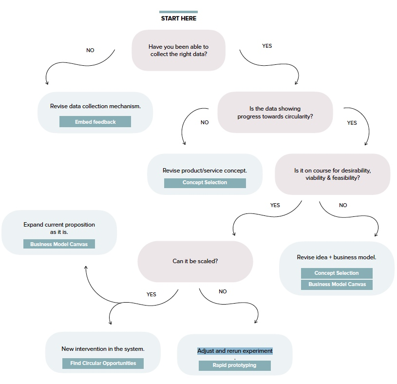

循环设计的产品即便在发布后也是没有尽头的，这是个无限循环的过程，在产品或服务的实际应用中，你或许会发现新的可循环设计点。 而一家成熟的公司如何利调整你的产品或服务以转型循环设计？ 公司内部和外部又需要做怎样的调整？ 

# 发布 Release
## 产品旅程地图 Product Journey Mapping
考虑您的产品或服务及其部件的使用周期。 问问自己随着时间的推移会发生什么 你的产品如何分解？然后会发生什么？

循环性意味着重新思考产品或服务的开始，中间和结束的线性使用周期。 如果一个产品或服务是真正的循环，它永远不会真正结束它的生命，而是会不断采取新的形式。 制定这一过程将确保您的产品尽可能长时间处于有用状态，并在每个阶段增加价值。

1. 你的产品或服务的使用周期是多长？ 可以如何的延长？ 
2. 下一步是什么？ 在第一次使用之后会发生什么？ 
    * 它返回到生物圈吗？ （例如生物降解的包装）
    * 它是否会被新用户重新使用？ （例如，某人在重新使用你的旧手机，或是将葡萄酒瓶盖制作成装饰物）
    * 是否能被修复（ 比如修一双靴子） 
    * 是否能够回厂重塑？（比如调换智能手机的部分零件，而不是买一个新的） 
    * 是否可以回收？ （比如熔化并重新使用的金属）

3. 这样做多个周期。您的产品或服务的不同部分被使用后的旅程是什么？ 您的产品很可能会随着使用周期的进一步分解而变成其核心元素 / 组件。
4. 在最终确定之前，请考虑丢弃，收集和恢复阶段的各个挑战。 （例如，特定产品或产品组件可能由可回收材料制成，但实际上不能回收。）
5. 对于没有循环路径的组件，如何重新设计？ 如果您需要帮助，可以参考[Smart Material Choices](https://www.circulardesignguide.com/post/materials)

## 发布产品 Launch to Learn 
学习如何为试点产品品做计划，考虑产品不同的接触点（循环设计意味着它可能会测试每个环节），并制定一个反馈计划。 对比测试的结果与您的循环计划的目标之间的关系。

在投入市场之前，试点产品是您的解决方案的试用期。 与原型设计不同的是，您应该对自己的解决方案充满信心，并且测试它如何与员工，支持，材料，资源和合作伙伴交互。

1. 从创建学习目标开始。 在高层次上，你希望通过你的试点产品实现什么目标？你希望学到什么？
2. 为了帮助澄清这些目标，请画出您的试点产品将会产品影响的所有接触点的地图 - 包括人员，地点和事物。 参考在[用户为中心的研究](http://circulardesignguide.com/post/lead-with-user-centred-research)的发现，思考系统中所有不同的用户以及他们的体验可能与试点产品的关系。
3. 现在，从你刚才构建出来的流程中， 从创意，到销售环节，到后续， 你希望在每个点上了解哪些信息。 
4. 制定一个计划来帮助你可以从试点产品中得到可用的信息 
    * 运营产品的时候，哪些是关键人物
    * 需要哪些资源
    * 可能会有哪些潜在风险？ 你如何应对？ 
    * 你需要衡量产品在循环系统中是成功的？ 
    * 如何通过反馈来衡量成功？ 你会使用定量数据吗？ 定性数据？ 两者的结合？
    * 在这个过程中你可能会进行多次迭代。 如果你所期望的结果没有实现，那么你如何迭代系统中可以改进的部分，而不是重新考虑整个解决方案？
    * 在测试中， [增强你的产品的可循环性](https://www.circulardesignguide.com/post/continuous-learning-loops)

## 探索新的合作关系 Imagine New Partnerships
设想一下新的或意想不到的合作伙伴关系，这些合作伙伴关系可以强化您的价值链，提高系统效率或建立更强大的商业， 这也将有助于实现一致性并明确如何共同前进。

在最初的原型开发之后，可能会出现新的机会，在更大的系统中扩大你的影响力。 你可能会发现需要与新组织合作。

1. 在制作商业画布阶段你可能已经写下了一些潜在和合作关系， 但是在用户研究和原型阶段你在不断演变，你可能会发现有新的合作关系合一帮助你提高你的产品或服务？ 
2. 当你在不断完善你的概念的时候， 有哪些新的机会诞生？ 你需要和谁谈谈以了解如何将其纳入其中？ （例如嵌入技术）
3. 利用头脑风暴来帮助你设想更多的合作伙伴，从而使你的价值链更加的有效
4. 一旦你发现了新的伙伴， 你可以做一些谈话准备
    * 寻找可以帮助你的合作伙伴理解对他们以及整个系统价值的点
 在对话过程中： 
    * 双方都需要作出哪些承诺来讲目标实现？ 并减少风险？ 
    * 在建立合作关系的时候有哪些基本原则？例如 谁会从可能创造的新商机中获益？
    *  设定使协作成功的参数 - 您将评估哪些合作伙伴是值得合作的？
    

## 创造你的故事 Create Your Narrative
了解围绕您的产品或服务讲述精彩故事的基本知识，以及它与循环性之间的关系。 是什么样的有代入感有情感性的故事是让人们愿意为你品牌投资？

你讲的故事可以是你的动因。 吸引人的故事可以创造客户忠诚度并深化利益相关者的投资。 有时候，最好的故事并不是说你做的事情是可持续性的，而只是你正在做的事情让你的产品有更好的体验。

1. 回顾你的品牌。思考你希望激起你的客户哪方面的情感因素，以及你想要引起的共鸣
2. 同客户产生共情 考虑您的循环产品或服务如何链接到核心业务驱动程序，例如：
    * 考虑超越产品来开发新的附加值客户服务（例如新型号或所有权，个性化或维修服务）
    * 更加适用客户需求
    * 同更多的人合作，而且不那么孤立
    * 通过闭环实现更多价值，适用可重复利用的材料
    * 解决商业模式中资源使用的风险
    * 激发你品牌目的

3. 创建一个故事板，帮助您思考想要与观众分享的信息。 尝试回答以下问题  ： 它是从一个大的，高尚的挑战开始，还是从一个人的一生的小故事开始？ 这取决于你！
    * 你正在解决什么问题？ 
    * 你的创新是什么？ （尽量简化，不要过度解释）
    * 为什么这么重要？ 以及相关性
    * 是什么让你产生了这个解决方法
    * 从某种程度上如何改变你的客户的生活？ 
    * 哪些故事支持你的故事？ 

4. 斟酌你的用词 - 你希望激起怎样的感情？ 你的故事人家是否买账？ 
5. 在你构建故事的时候，要尽量细化，使用同情的语言。 
6. 最重要的是，选择一个焦点并为您的故事创建一条主线。 一旦你有了这些组件，想一想你会怎样把这个故事告诉给喝醉的人或者你的祖母。 它是可以关联的吗？ 它是否在你的行业和背景之外存在？

## 调整你的公司 Align Your Organisation
学习如何应用设计思维的原则，以确保您的组织如何变化才能符合循环设计。

无论你是在一家大公司工作，还是一家小型初创公司，当您重复循环业务并打算扩大规模时，会对您，您的团队，您的公司以及系统中的合作伙伴需要如何运作产生影响。改变已经建立的公司会很难，但可以利用设计思维

1. 使用组织设计工作表，考虑每个领域，并回答在您认为将是优先考虑的问题。 成功的组织应该与他们的用户主张保持一致，以及他们如何对他们所属的系统做出贡献，而不仅仅是他们自己的内部需求。
    * PROCESS： 您如何重新设计所有内部流程以符合为用户提供服务？与运营者和接受他们的人（内部或外部）共同创造新的流程。
    *  INCENTIVES：考虑如何激励团队进行连续的设计循环，因为 循环设计无止境。你如何庆祝学习和迭代产品的发布？您如何与连锁店的合作伙伴合作，为您的设计师提供不同的视角？
    *  STRATEGY：你的战略是否正确？请参阅商业画布并运用新的数据重复该操作。
    *  TALENT： 你怎么做实验：短期合同，借助其他团队的人，同其他能填补你龙漏洞的公司合作？ 什么新功能和角色在你的组织和组织之外诞生？你的人才策略是什么？思考招聘，培训，组织和伙伴关系。
    *  INFRASTRUCTURE：你有面向未来的IT系统么？ 尝试使用现有的技术或开源系统来测试，在制定定制的技术前。 你和合适的运营空间么？尝试在临时空间里协同工作看能找到什么样的协作方式和伙伴
    *  STRUCTURE： 你的团队或公司结构如何？旨在给到所有用户的么？你是否需要考虑结构变化以允许跨学科团队协同工作，还是可以通过新的工作方式来实现？在进行结构变更之前，尝试同更多的多跨学科团队合作。
   
3. 通过与员工和内部利益相关者进行研究，找出改变工作方式的机会，从而创造价值主张。
4. 创建一些组织假设来测试你的想法。 （例如，“我们如何开发一个灵活的，可扩展的资源来管理我们的响应中心？”）
5. 设计一些 “实验” 或原型，以测试您的组织变化以及产品或服务。 确保这个测试只需要很少的努力 - 重点是学习和迭代。 （例如，在向全职团队成员提交之前，短期雇用新的人来测试这些是否是您需要这些技能）。
6. 继续这一过程来提供您的价值主张，并为您所参与的系统做出贡献。 请记住，组织设计将会不断发展并与您的产品或服务设计一样迭代。 

## 继续循环 Continuous Learning Loops
了解如何使用反馈来计划您的产品或服务的下一步内容 - 为你的产品提供迭代，为业务增长带来新的机会，或者发现您的下一次循环设计机会，甚至是迭代反馈机制本身。

循环经济设计是连续的。 这就是为什么创建反馈周期以及从你所得到的输入中学习很重要的原因。 这将帮助您使用您收集的反馈来探索下一步的设计迭代并继续为您的业务和系统整体增值。

1. 根据您在嵌入式反馈机制中收集的反馈以及您在商业画布中的总体战略回顾您的进度。
2. 首先询问你是否已经实现了你的目标。 你能找到你提出的问题的答案吗？
3. 通过你学习内容的模式和见解来综合此反馈。 你正在学习的东西如何转变你的想法？
4. 回答以下问题
    * 你需要改变反馈机制吗
    * 它是否为您提供了有价值的数据，或者您是否在浪费时间收集某些信息？
    * 您需要做些什么来改变您的产品或服务，以确保它为您带来商业价值，并为整个系统增加价值？
    * 您如何更好地为您的产品 / 服务做好准备，不仅仅是为了消费者，而是价值链中的其他用户？
    * 您的产品或服务是否从可用性或技术角度出现故障？ 有什么需要调整以使其更好地工作？
    * 你的下一个循环设计点在哪？ 你会扩大统一模式，或通过扩大系统中不同的带你来提高你的影响力吗
    * 回到Definde Section 制定扩张的计划

